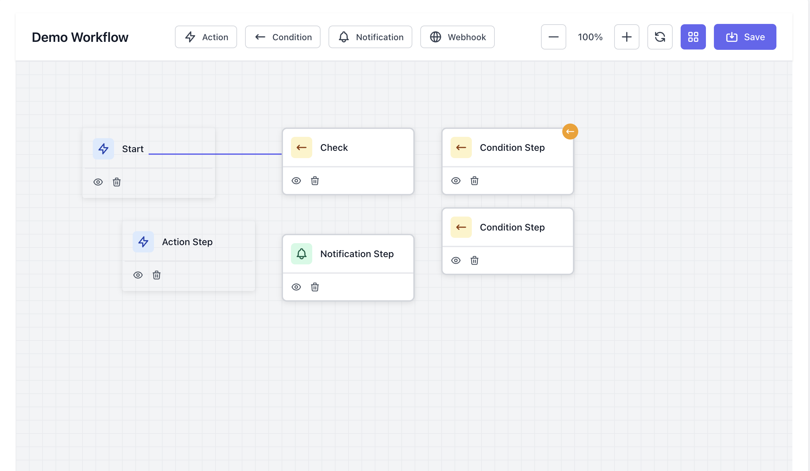
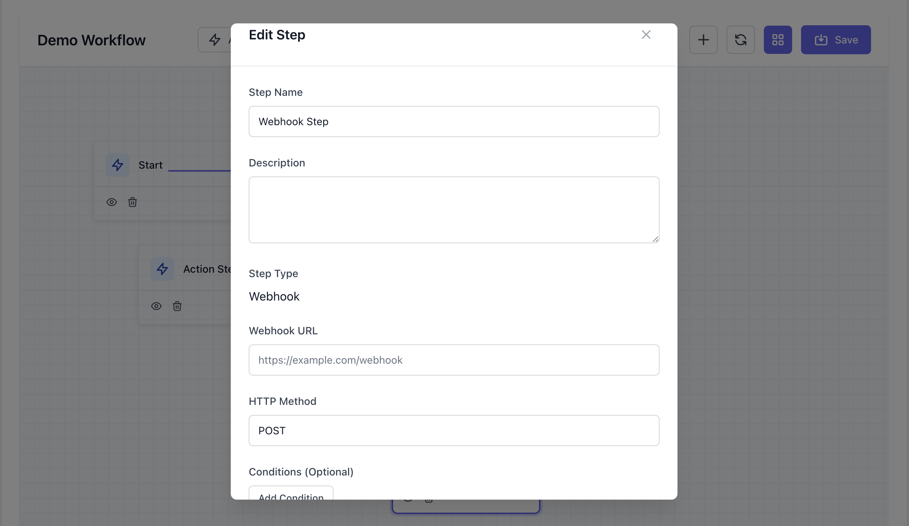

# ForgePulse Art

ForgePulse provides a powerful, visual workflow builder for Laravel applications. Below is an overview of its key features.

## Visual Workflow Builder

The core of ForgePulse is its drag-and-drop interface, allowing you to design complex workflows with ease.

## Interactive Toolbar

The toolbar provides quick access to all available step types (Webhook, Action, Condition, Notification) and canvas controls.

## Step Configuration

Clicking on any step opens a dedicated configuration modal where you can set specific properties, names, and conditions.

